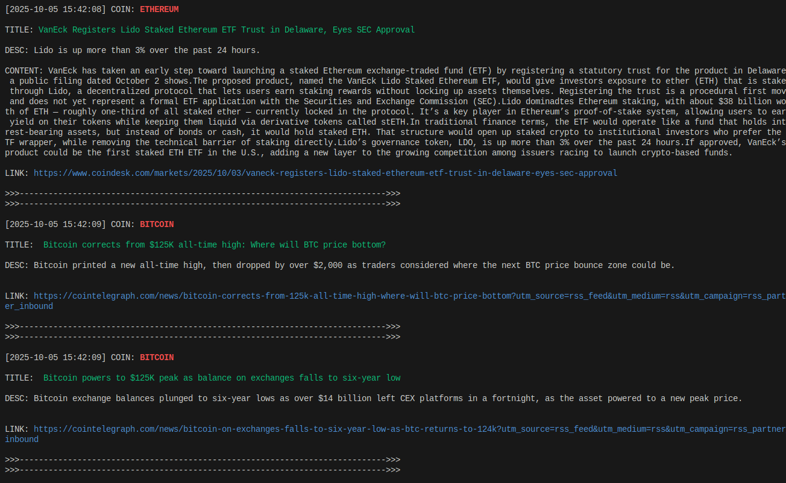

# crypto-news-selector
## Description
This parser can collect news from RSS feeds for selected crypto projects. The news is displayed in the terminal and written to a file at the same time. The files are archived once a month (this feature works when the application is running as a daemon(TODO)). 
The frequency of RSS feed polling can be configured in ./config/config.json. The default setting is 5 minutes. Therefore, the RSS feed is polled every 5 minutes and the news is displayed in the terminal.
It's convenient to use the app as a background app to get your favorite news online and not miss anything ;)
## Settings
The basic settings of the application are in the file ./config/config.json
```json
{
  "interval": "5m",
  "file_settings": {
    "archive_dir": "archive",
    "archive_life": "2160h",
    "daily_check_interval": "24h",
    "log_retention": "336h",
    "max_workers": 5
  },
  "rss": [
    {
      "name": "coindesk",
      "url": "https://www.coindesk.com/arc/outboundfeeds/rss/"
    },
    {
      "name": "cointelegraph",
      "url": "https://cointelegraph.com/rss"
    },
    {
      "name": "u.today",
      "url": "https://u.today/rss.php"
    }
  ]
}


```
- interval - RSS message check interval;
- file_settings - Settings for working with a file system;
    - archive_dir - The name of the catalog where the archives will be placed
    - archive_life - Archive life
    - daily_check_interval - Will delete all archives older than file_settings.archive_Life
    - log_retention - Deadline for file archiving
    - max_workers - Maximum at the same time working Gorutin
- rss - Array with data for collecting news.

A list of projects for which we want to receive news must be placed in the file ./projects. He must have this look.
```ini
BITCOIN
ethereum
Cosmos Hub
```
Each project on a separate line. The letter register does not matter.
## Use
```sh
git clone git@github.com:vzx7/crypto-news-selector.git
cd crypto-news-selector
go mod tidy
go run main.go
# Or build and run
go build -o crypto-news-selector
./crypto-news-selector
```
## Example

## TODO
- Add a layer to launch an application as a Systemd demon.
- Add the output of the current project price.
- Add tests.
## License
MIT